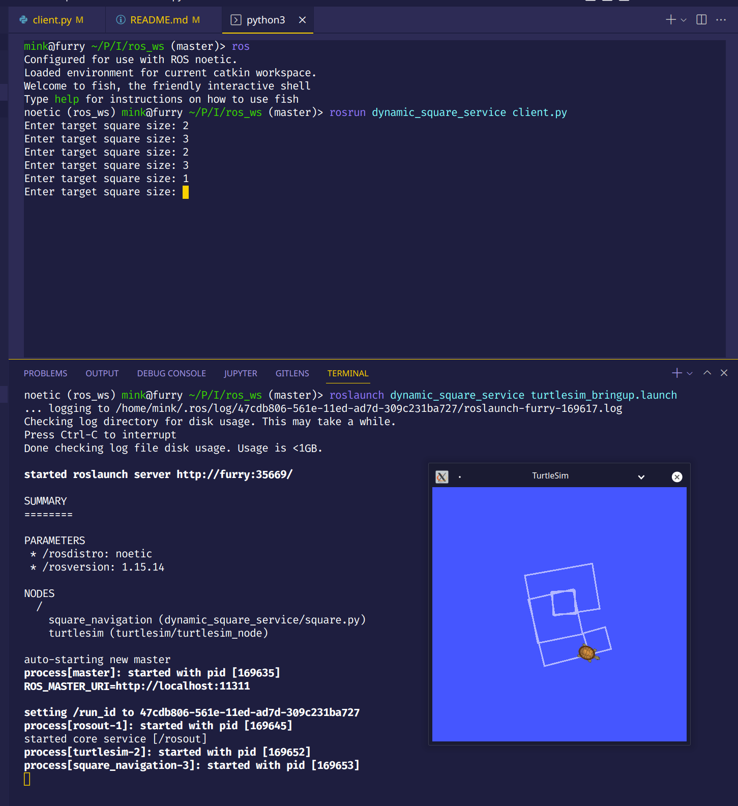

# Dynamic Square Service

This project re-uses the open loop square code from earlier and provides a service to control what the size of the square should be. A better implementation would talk to the actionlib interface made last week but this is just for demonstration purposes of services.

Launch turtlesim and service:

```bash
roslaunch dynamic_square_service turtlesim_bringup.launch
```

Start a sample service client:

```bash
rosrun dynamic_square_service client.py
```

## Screenshot


